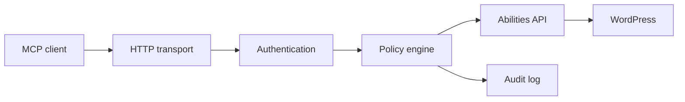

# WPNerve

**The native agent gateway for WordPress.**

WPNerve is a self-hosted WordPress plugin that exposes carefully selected native
WordPress Abilities as Model Context Protocol (MCP) tools. It runs entirely inside
the WordPress installation: no relay, SaaS control plane, or external database is
required.

> **Project status:** early alpha. The protocol foundation and first read-only
> diagnostic ability are implemented. Do not install this branch on a production
> site before the security review and beta milestone are complete.

## Why WPNerve

- Native WordPress 6.9+ Abilities API instead of a parallel action registry.
- MCP `2026-07-28` stateless HTTP plus compatibility with `2025-11-25` and
  `2025-06-18` clients.
- WordPress Application Password authentication over HTTPS.
- A central policy gate separate from ability business logic.
- Least-privilege tool discovery: users see only abilities they can execute.
- Privacy-preserving audit events without credentials or tool arguments.
- Destructive and privileged risk classes denied by default.

## Architecture



The protocol, transport, policy, and WordPress ability layers are deliberately
separate. A future protocol revision can replace the transport and dispatcher
without rewriting content operations.

See [Architecture](docs/architecture.md) and [Threat model](docs/threat-model.md).

## Current vertical slice

The first tool is `wp_nerve_site_status`. It returns non-sensitive connection and
runtime diagnostics for an authenticated user with the `edit_posts` capability.

The MCP endpoint is:

```text
https://example.com/wp-json/wp-nerve/v1/mcp
```

### Modern discovery request

Replace the host, username, and Application Password. Never commit the password.

```bash
curl --user 'USERNAME:APPLICATION_PASSWORD' \
  --header 'Content-Type: application/json' \
  --header 'MCP-Protocol-Version: 2026-07-28' \
  --header 'Mcp-Method: server/discover' \
  --data '{
    "jsonrpc": "2.0",
    "id": 1,
    "method": "server/discover",
    "params": {
      "_meta": {
        "io.modelcontextprotocol/protocolVersion": "2026-07-28",
        "io.modelcontextprotocol/clientCapabilities": {},
        "io.modelcontextprotocol/clientInfo": {
          "name": "manual-test",
          "version": "1.0.0"
        }
      }
    }
  }' \
  'https://example.com/wp-json/wp-nerve/v1/mcp'
```

## Requirements

- WordPress 6.9 or newer.
- PHP 8.1 or newer.
- HTTPS in production.
- Pretty permalinks and the WordPress REST API available.

## Development

```bash
composer install
composer check
```

`composer check` runs PHP syntax validation, coding standards, PHPStan level 8,
and PHPUnit.

## Security posture

- The endpoint is private and requires an authenticated WordPress user.
- Production HTTP without TLS is rejected.
- Tool discovery and execution both pass through the same policy engine.
- MCP mirrored headers are checked against the JSON-RPC body.
- Unknown external WordPress abilities are not exposed automatically.
- Tool arguments, authorization headers, and Application Passwords are never
  written to the WPNerve audit table.

Report vulnerabilities privately according to [SECURITY.md](SECURITY.md).

## Roadmap

The scoped v1 ability catalog is documented in [Abilities v1](docs/abilities-v1.md).
Content reads and safe draft mutations come next; plugin, theme, filesystem,
`wp-config.php`, and unrestricted option operations are outside the initial scope.

## License

GPL-2.0-or-later. See [LICENSE](LICENSE).

