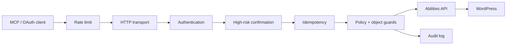

# WPNerve

**The native agent gateway for WordPress.**

[](https://wordpress.org/)
[](https://www.php.net/)
[](LICENSE)
[](CHANGELOG.md)
[](https://www.instagram.com/akelaonline/)

WPNerve is a self-hosted WordPress plugin that exposes carefully selected native
WordPress **Abilities** as **Model Context Protocol (MCP)** tools. It runs inside
the WordPress installation: no relay, no SaaS control plane, no Firebase, and no
external database.

> 🇬🇧 English documentation first — 🇪🇸 documentación en español más abajo.

> **Project status: early alpha.** The v1 contract contains exactly **53 registered
> abilities**. Alpha.11 adds live runtime diagnostics that separate the registered
> catalog from the abilities actually discoverable for the current WordPress user,
> plus an explicit site-owner opt-in for reviewed abilities whose default is off.
> Least-privilege onboarding, persistent mutation idempotency, out-of-band
> high-risk confirmation, fail-closed endpoint rate limiting, privileged-surface
> hardening, and the OAuth lifecycle controls are implemented. This is not yet a
> production-readiness claim: real WordPress/Multisite, strict-client, wire,
> filesystem/fuzzing, retention, and independent security-review gates remain.

---

## English

### What WPNerve does

Install one plugin and your WordPress site exposes a private, authenticated MCP
endpoint for agents. The agent can discover and execute only reviewed,
schema-defined abilities, subject to the same WordPress capabilities and
object-level permissions you already administer.

WPNerve deliberately does **not** expose arbitrary SQL, PHP, shell, WP-CLI,
filesystem editing, `wp-config.php`, or every third-party ability registered in
WordPress. Those surfaces remain outside the core unless a future threat model
proves a narrow design.

### Why WPNerve

- **Native WordPress 6.9+ Abilities API.** No parallel action registry.
- **Self-hosted.** No relay or SaaS credential store.
- **MCP compatibility.** Stateless MCP `2026-07-28`, plus bounded compatibility
  with `2025-11-25` and `2025-06-18`.
- **WordPress-native authentication.** Application Passwords plus a constrained
  OAuth public-client flow for clients that cannot send Basic Auth.
- **Least privilege.** Discovery and execution both respect WordPress
  capabilities and WPNerve policy.
- **Fail-closed mutations.** Every mutation requires persistent idempotency.
- **High-risk confirmation.** Destructive and privileged calls are disabled by
  default and, when enabled, require short-lived WordPress-admin approval.
- **Independent boundary budgets.** MCP and OAuth authorization, token,
  revocation, and registration routes are rate-limited independently.
- **Privileged surface guards.** Narrow option/transient access, administrator
  restrictions, plugin self-protection, checksummed plugin uploads, and debug-log
  redaction.
- **Privacy-preserving audit.** Tool arguments and credentials are not persisted
  in the normal audit records.
- **Runtime catalog diagnostics.** Tools → WPNerve Diagnostics compares the exact
  53-ability code contract with WordPress' live registry and current discovery
  policy, listing any blocked tools by name.

### OAuth security profile — alpha.10+

OAuth exists only for MCP clients that cannot send WordPress Application
Passwords. The implemented public-client profile requires:

- authorization code grant;
- PKCE `S256` only;
- a non-empty bounded `state`;
- exact pre-registered redirect URIs;
- HTTPS for remote redirect URIs;
- plain HTTP only for loopback IP clients (`127.0.0.1` / `::1`);
- single-use authorization codes;
- separate access-token and refresh-token lifetimes;
- refresh-token rotation and replay rejection;
- token revocation;
- bounded dynamic-client registration;
- hashed authorization-code/access-token/refresh-token storage;
- `no-store`, `no-cache`, and `nosniff` response handling.

See [OAuth security profile](docs/security/oauth.md).

### Architecture



Protocol, transport, policy, security, and WordPress ability layers remain
separate so protocol changes do not require rewriting WordPress operations.

### Quick start

1. Install and activate WPNerve on WordPress 6.9+ with PHP 8.1+.
2. Open **Tools → WPNerve**.
3. Select a dedicated WordPress user with only the capabilities the agent needs.
4. Generate a WPNerve Application Password and copy the one-time client config.
5. Open **Tools → WPNerve Diagnostics** and verify the live registered and
   discoverable counts. On a disposable staging site, the full reviewed
   53-ability surface can be enabled in one click.
6. Connect the client to:
   `https://your-site.com/wp-json/wp-nerve/v1/mcp`
7. Revoke the credential from the same screen when the client is retired.
8. If high-risk tools are explicitly enabled, approve each matching operation in
   **Tools → WPNerve** before retrying it from the client.

Never commit or share an Application Password from a real site.

### Selected tools

| Tool | Description | Risk |
|---|---|---|
| `wp_nerve_site_status` | Non-sensitive site/runtime diagnostics | Read |
| `wp_nerve_list_content_types` | Public content types and supports | Read |
| `wp_nerve_search_content` | Search content with type/status/pagination controls | Read |
| `wp_nerve_get_content` | Read one content item subject to status/capability | Read |

The v1 catalog contains **exactly 53 registered abilities** across content
lifecycle, revisions, taxonomy, media, comments, menus, widgets, users, plugins,
options, and system diagnostics. A client can discover fewer because per-ability
enablement, risk classes, and WordPress capabilities are independent policy
gates. See [Ability catalog v1](docs/abilities-v1.md).

### MCP discovery example

```bash
curl --user 'USERNAME:APPLICATION_PASSWORD' \
  --header 'Content-Type: application/json' \
  --header 'MCP-Protocol-Version: 2026-07-28' \
  --header 'Mcp-Method: server/discover' \
  --data '{
    "jsonrpc": "2.0",
    "id": 1,
    "method": "server/discover",
    "params": {
      "_meta": {
        "io.modelcontextprotocol/protocolVersion": "2026-07-28",
        "io.modelcontextprotocol/clientCapabilities": {},
        "io.modelcontextprotocol/clientInfo": {
          "name": "manual-test",
          "version": "1.0.0"
        }
      }
    }
  }' \
  'https://example.com/wp-json/wp-nerve/v1/mcp'
```

### Security posture

- Production HTTP without TLS is rejected.
- Discovery never grants authority by itself.
- Authentication metadata supplied by the client is not an authorization signal.
- MCP mirrored headers are checked against the JSON-RPC body.
- Every mutation is authorized again before execution.
- Persistent idempotency prevents a completed mutation from being duplicated by
  a retry.
- Destructive/privileged operations require narrow opt-in and matching approval.
- Explicit per-ability opt-ins never bypass WordPress capabilities or risk-class
  policy.
- Rate-limit storage failure fails closed.
- Arbitrary `Forwarded` / `X-Forwarded-For` values do not select the rate-limit
  identity.
- WPNerve cannot deactivate or delete itself through its MCP plugin tools.
- Sensitive option/transient and administrator-account boundaries remain
  protected even when a broad privileged risk class is enabled.
- OAuth codes and rotated refresh tokens cannot be successfully consumed twice.
- OAuth persistence failure cannot issue credentials whose lifecycle WPNerve
  cannot track.
- Runtime-double success is not accepted as proof of production compatibility.

Report vulnerabilities according to [SECURITY.md](SECURITY.md).

### Requirements

- WordPress 6.9+
- PHP 8.1+
- HTTPS in production
- WordPress REST API available

### Development and validation

```bash
composer install
composer check        # PHP lint + PHPCS + PHPStan level 8 + PHPUnit
composer test         # PHPUnit only
```

The repository keeps GitHub workflow definitions for explicit manual validation,
but **automatic GitHub Actions triggers are currently paused**. An absent hosted
CI run must not be interpreted as a passing check. Before beta, the roadmap
requires real WordPress/PHP/Multisite execution, MCP wire evidence, strict OAuth
client/browser evidence, fuzzing, retention testing, and independent review.

### Documentation

- [Architecture](docs/architecture.md)
- [Threat model](docs/threat-model.md)
- [Beta-readiness roadmap](docs/roadmap/beta-readiness.md)
- [Ability catalog v1](docs/abilities-v1.md)
- [Mutation idempotency](docs/security/idempotency.md)
- [High-risk confirmations](docs/security/confirmations.md)
- [Rate limiting](docs/security/rate-limits.md)
- [Privileged surfaces](docs/security/privileged-surfaces.md)
- [OAuth security profile](docs/security/oauth.md)
- [Architecture decision records](docs/adr/)

---

## Español

### Qué es WPNerve

WPNerve convierte WordPress en un endpoint MCP privado para agentes de IA usando
la **Abilities API nativa de WordPress**. El agente descubre y ejecuta sólo
abilities revisadas, con schema, respetando capabilities de WordPress, políticas
de WPNerve y autorizaciones por objeto.

No hay relay, SaaS, Firebase ni base externa. Tampoco se expone SQL, PHP, shell,
WP-CLI, edición arbitraria del filesystem o `wp-config.php`.

### Catálogo y diagnóstico runtime

El contrato v1 contiene **exactamente 53 abilities registradas**. Eso no significa
que las 53 deban aparecerle a cualquier cliente: el opt-in individual, la clase
de riesgo y las capabilities del usuario son gates separados. **Herramientas →
WPNerve Diagnostics** muestra ambos números desde el WordPress real y lista por
nombre cualquier ability bloqueada. En un staging descartable se puede habilitar
la superficie completa revisada con un clic sin desactivar las demás barreras de
seguridad.

### Por qué existe

- Abilities API nativa de WordPress 6.9+.
- MCP `2026-07-28` y compatibilidad acotada con `2025-11-25` / `2025-06-18`.
- Application Passwords y OAuth público acotado.
- Descubrimiento con mínimo privilegio.
- Idempotencia persistente para toda mutación.
- Confirmación desde WordPress para operaciones destructivas/privilegiadas.
- Rate limiting fail-closed separado por frontera.
- Protecciones específicas para usuarios, plugins, options, transients y logs.
- Auditoría sin guardar argumentos ni credenciales.

### OAuth en alpha.10+

El flujo OAuth está pensado para clientes MCP que no pueden enviar Application
Passwords. Exige PKCE S256, `state`, redirects exactos, HTTPS remoto, HTTP sólo
para loopback, códigos de autorización de un solo uso, rotación de refresh
tokens, revocación, límites de clientes y almacenamiento hasheado de
credenciales.

### Inicio rápido

1. Instalá y activá WPNerve en WordPress 6.9+ / PHP 8.1+.
2. Abrí **Herramientas → WPNerve**.
3. Elegí un usuario dedicado con el mínimo de capabilities necesarias.
4. Generá la credencial y copiá la configuración del cliente.
5. Abrí **Herramientas → WPNerve Diagnostics** y verificá `53 / 53` en el
   registro. En un staging descartable podés habilitar la superficie completa de
   prueba con un clic.
6. Conectá al endpoint:
   `https://tu-sitio.com/wp-json/wp-nerve/v1/mcp`
7. Revocá la credencial cuando retires el cliente.
8. Si habilitás herramientas de alto riesgo, aprobá cada operación desde
   WordPress antes del reintento.

### Estado de seguridad

WPNerve está en **early alpha**, no en producción. Los controles de G1–G5 están
implementados a nivel código/adversarial, pero antes de beta faltan pruebas con
WordPress y base reales, Multisite, proxies/browser, clientes MCP estrictos,
filesystem/ZIP adversarial, fuzzing, retención y revisión independiente.

Los workflows de GitHub quedan disponibles para ejecución manual, pero los
triggers automáticos de Actions están pausados. No se considera “verde” aquello
que no fue ejecutado.

### Desarrollo

```bash
composer install
composer check
composer test
```

### Documentación

- [Arquitectura](docs/architecture.md)
- [Modelo de amenazas](docs/threat-model.md)
- [Roadmap de beta](docs/roadmap/beta-readiness.md)
- [Catálogo de abilities v1](docs/abilities-v1.md)
- [Idempotencia](docs/security/idempotency.md)
- [Confirmaciones de alto riesgo](docs/security/confirmations.md)
- [Rate limiting](docs/security/rate-limits.md)
- [Superficies privilegiadas](docs/security/privileged-surfaces.md)
- [Perfil OAuth](docs/security/oauth.md)

---

## Akela WordPress

> **Production-grade WordPress infrastructure for performance, SEO, automation and AI agents.**

WPNerve forma parte de la familia **Akela WordPress**:

- **[WP-Nerve](https://github.com/akelaonline/WP-Nerve)** — native control layer / MCP gateway para agentes y WordPress.
- **Akela SEO** — SEO técnico y automatizable para WordPress.
- **PageRelay** — AI-to-WordPress deployment layer para páginas nativas, editables y reversibles.
- **[NO Comments](https://github.com/akelaonline/No-comments)** — cierre y limpieza integral de comentarios, con REST y WP-CLI.
- **Tucho Performance** — performance, caché y optimización WordPress 100% local.

Los productos son independientes, pero comparten los mismos principios:
**self-hosted cuando importa, APIs explícitas, seguridad por diseño,
observabilidad y operación real en producción.**

### Professional ecosystem

- **[MKT Marketing Digital](https://mktmarketingdigital.com)** — agencia de marketing digital, implementación y growth.
- **[The Thing](https://thethingapp.com)** — producto de MKT para atención y ventas con IA.
- **[Marketing Digital Experience](https://marketingdigitalexperience.com)** — consultoría, formación y transferencia de conocimiento en IA aplicada.
- **[Nubelytics](https://nubelytics.com)** — analytics + AI para ecommerce.
- **[Zantal](https://zantal.ai)** — agentic commerce intelligence.

---

## Autor, soporte y contacto

Built by **Alejandro Daniel José · Akela**.

[](https://github.com/akelaonline)
[](https://www.instagram.com/akelaonline/)
[](https://mktmarketingdigital.com)
[](https://marketingdigitalexperience.com)
[](mailto:alejandro@mktmarketingdigital.com)

- Bugs y mejoras técnicas: [GitHub Issues](https://github.com/akelaonline/WP-Nerve/issues).
- Vulnerabilidades: [SECURITY.md](SECURITY.md).
- Implementación e integraciones: [MKT Marketing Digital](https://mktmarketingdigital.com).
- Consultoría y capacitación en IA: [Marketing Digital Experience](https://marketingdigitalexperience.com).

### License

GPL-2.0-or-later. See [LICENSE](LICENSE).
