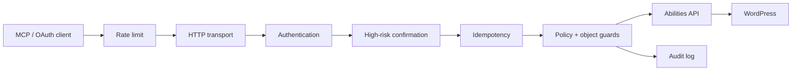
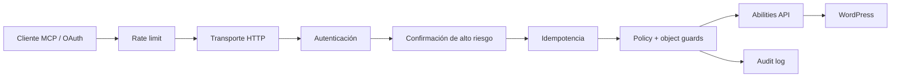

# WPNerve

**The native agent gateway for WordPress.**

[](https://github.com/akelaonline/WP-Nerve/actions)
[](https://github.com/akelaonline/WP-Nerve/actions)
[](https://wordpress.org/)
[](https://www.php.net/)
[](LICENSE)
[](https://www.instagram.com/akelaonline/)

WPNerve is a self-hosted WordPress plugin that exposes carefully selected native
WordPress **Abilities** as **Model Context Protocol (MCP)** tools. It runs entirely
inside the WordPress installation: no relay, no SaaS control plane, no external
database.

> 🇬🇧 Full docs in English below — 🇪🇸 Documentación completa en español más abajo.

> **Project status:** early alpha. The 53-ability v1 surface, secure credential
> onboarding, persistent mutation idempotency, out-of-band high-risk confirmation,
> fail-closed endpoint rate limiting and privileged-surface hardening are
> implemented. Do not install this branch on a production site before the
> remaining beta gates and security review complete.

---

## English

### What is WPNerve?

WPNerve turns WordPress into a first-class citizen for AI agents. Instead of
punching holes into `wp-admin` or using a SaaS relay that stores your credentials,
you install one plugin and get a **private, authenticated MCP endpoint** on your
own site. An agent can inspect and manage the selected surfaces using the same
WordPress capabilities and permissions you already manage in the admin.

WPNerve deliberately does not expose “100% of WordPress.” Arbitrary SQL, PHP,
shell, WP-CLI, filesystem and `wp-config.php` access remain outside the core;
only reviewed, schema-defined abilities become MCP tools.

- **Native.** Built on the WordPress 6.9+ Abilities API instead of a parallel
  action registry.
- **Self-hosted.** Runs inside WordPress. No external service ever sees your
  requests or credentials.
- **Secure by default.** HTTPS required in production, WordPress-native
  authentication, fail-closed boundary controls and a central policy engine that
  denies destructive and privileged actions by default.

### Why WPNerve

- WordPress 6.9+ native Abilities API, not a parallel action registry.
- MCP `2026-07-28` stateless HTTP plus compatibility with clients `2025-11-25` and
  `2025-06-18`.
- WordPress Application Password and OAuth 2.1 authentication over HTTPS.
- A central policy gate separate from ability business logic.
- Least-privilege tool discovery: each user sees only the abilities they can
  execute subject to object-level authorization.
- Privacy-preserving audit events without credentials or tool arguments.
- Destructive and privileged risk classes denied by default.
- Persistent idempotency for every mutation.
- Short-lived WordPress-admin confirmation for destructive and privileged calls.
- Independent fail-closed rate limits for MCP and OAuth boundaries.
- Additional allowlists, redaction and object guards around users, plugins,
  options, transients and system diagnostics.

### Architecture



The protocol, transport, policy, security, and WordPress ability layers are
deliberately separate. A future protocol revision can replace the transport and
dispatcher without rewriting content operations. See
[Architecture](docs/architecture.md) and [Threat model](docs/threat-model.md).

### Quick start

1. **Install and activate** the plugin on a WordPress 6.9+ site (PHP 8.1+).
2. Open **Tools → WPNerve** to see your MCP endpoint:
   `https://your-site.com/wp-json/wp-nerve/v1/mcp`
3. In **Tools → WPNerve**, select a dedicated WordPress user with only the
   capabilities the agent needs and click **Generate WPNerve credential**.
4. Copy the one-time secret or the ready-to-use client configuration. WPNerve
   verifies the credential against its MCP endpoint without persisting it.
5. Revoke WPNerve credentials from the same screen when a client is retired or
   a device is lost.
6. If you enable destructive or privileged risk classes and individual tools,
   approve each matching short-lived operation code in **Tools → WPNerve** before
   the client retries it.

Never commit or share the Application Password. If a client or device is lost,
revoke the password immediately.

### Selected tools

| Tool | Description | Risk |
|---|---|---|
| `wp_nerve_site_status` | Non-sensitive site and WPNerve runtime diagnostics | Read |
| `wp_nerve_list_content_types` | Public content types with REST and supports info | Read |
| `wp_nerve_search_content` | Search content with post type, status, and pagination controls | Read |
| `wp_nerve_get_content` | Single post with full content, gated by status and capability | Read |

The implemented v1 catalog contains 53 abilities across content lifecycle,
revisions, taxonomy, media, comments, menus, widgets, users, plugins, options and
system diagnostics. See the [full ability catalog](docs/abilities-v1.md).

### Example requests

Replace the host, username, and Application Password. Never commit the password.

**Discovery (modern protocol):**

```bash
curl --user 'USERNAME:APPLICATION_PASSWORD' \
  --header 'Content-Type: application/json' \
  --header 'MCP-Protocol-Version: 2026-07-28' \
  --header 'Mcp-Method: server/discover' \
  --data '{
    "jsonrpc": "2.0",
    "id": 1,
    "method": "server/discover",
    "params": {
      "_meta": {
        "io.modelcontextprotocol/protocolVersion": "2026-07-28",
        "io.modelcontextprotocol/clientCapabilities": {},
        "io.modelcontextprotocol/clientInfo": {
          "name": "manual-test",
          "version": "1.0.0"
        }
      }
    }
  }' \
  'https://example.com/wp-json/wp-nerve/v1/mcp'
```

**List tools:**

```bash
curl --user 'USERNAME:APPLICATION_PASSWORD' \
  --header 'Content-Type: application/json' \
  --header 'MCP-Protocol-Version: 2026-07-28' \
  --header 'Mcp-Method: tools/list' \
  --data '{
    "jsonrpc": "2.0",
    "id": 2,
    "method": "tools/list",
    "params": {
      "_meta": {
        "io.modelcontextprotocol/protocolVersion": "2026-07-28",
        "io.modelcontextprotocol/clientCapabilities": {},
        "io.modelcontextprotocol/clientInfo": {
          "name": "manual-test",
          "version": "1.0.0"
        }
      }
    }
  }' \
  'https://example.com/wp-json/wp-nerve/v1/mcp'
```

**Call a tool:**

```bash
curl --user 'USERNAME:APPLICATION_PASSWORD' \
  --header 'Content-Type: application/json' \
  --header 'MCP-Protocol-Version: 2026-07-28' \
  --header 'Mcp-Method: tools/call' \
  --header 'Mcp-Name: wp_nerve_site_status' \
  --data '{
    "jsonrpc": "2.0",
    "id": 3,
    "method": "tools/call",
    "params": {
      "name": "wp_nerve_site_status",
      "arguments": {},
      "_meta": {
        "io.modelcontextprotocol/protocolVersion": "2026-07-28",
        "io.modelcontextprotocol/clientCapabilities": {},
        "io.modelcontextprotocol/clientInfo": {
          "name": "manual-test",
          "version": "1.0.0"
        }
      }
    }
  }' \
  'https://example.com/wp-json/wp-nerve/v1/mcp'
```

### Security posture

- The endpoint is private and requires an authenticated WordPress user.
- Production HTTP without TLS is rejected.
- Tool discovery and execution both pass through WPNerve policy and WordPress
  capability checks.
- MCP mirrored headers are checked against the JSON-RPC body.
- Unknown external WordPress abilities are not exposed automatically.
- Every mutation requires a credential-bound idempotency key.
- Destructive and privileged calls are hidden by default and require an
  expiring, argument-bound decision in the WordPress admin when enabled.
- Public MCP/OAuth boundaries have independent request budgets that fail closed.
- Arbitrary forwarding headers are not trusted to select the rate-limit subject.
- Protected options/transients and administrator-account boundaries have
  additional fail-closed guards beyond the broad risk class.
- Tool arguments, authorization headers, and Application Passwords are never
  written to the WPNerve audit table.

Report vulnerabilities privately according to [SECURITY.md](SECURITY.md).

### Requirements

- WordPress 6.9 or newer.
- PHP 8.1 or newer.
- HTTPS in production.
- Pretty permalinks and the WordPress REST API available.

### Development

```bash
composer install
composer check        # lint + PHPCS + PHPStan level 8 + PHPUnit
composer test         # PHPUnit only
```

`composer check` runs PHP syntax validation, coding standards, PHPStan level 8,
and the unit test suite. CI runs the same checks on PHP 8.1, 8.3, and 8.5,
verifies version consistency, and publishes a coverage report on every push.

### Documentation

- [Architecture](docs/architecture.md)
- [Threat model](docs/threat-model.md)
- [Beta-readiness roadmap](docs/roadmap/beta-readiness.md)
- [Ability catalog v1](docs/abilities-v1.md)
- [Mutation idempotency](docs/security/idempotency.md)
- [High-risk confirmations](docs/security/confirmations.md)
- [Rate limiting](docs/security/rate-limits.md)
- [Privileged surfaces](docs/security/privileged-surfaces.md)
- [Architecture decision records](docs/adr/)

### License

GPL-2.0-or-later. See [LICENSE](LICENSE).

---

## Español

### ¿Qué es WPNerve?

WPNerve convierte a WordPress en un ciudadano de primera clase para los agentes
de IA. En lugar de abrir agujeros en `wp-admin` o usar un relay SaaS que guarda
tus credenciales, instalás un plugin y obtenés un **endpoint MCP privado y
autenticado** en tu propio sitio. Un agente puede inspeccionar y gestionar las
superficies seleccionadas usando las mismas capacidades y permisos de WordPress
que ya administrás en el panel.

WPNerve no expone deliberadamente “el 100% de WordPress”. SQL, PHP, shell,
WP-CLI, filesystem y `wp-config.php` arbitrarios quedan fuera del núcleo; sólo
abilities revisadas y con schema se convierten en herramientas MCP.

- **Nativo.** Construido sobre la Abilities API nativa de WordPress 6.9+, no
  sobre un registro de acciones paralelo.
- **Self-hosted.** Corre dentro de WordPress. Ningún servicio externo ve tus
  pedidos o credenciales.
- **Seguro por defecto.** HTTPS obligatorio en producción, autenticación nativa
  de WordPress, límites fail-closed y un policy engine central que deniega
  acciones destructivas y privilegiadas por defecto.

### Por qué WPNerve

- Abilities API nativa de WordPress 6.9+, no un registro paralelo de acciones.
- MCP `2026-07-28` stateless HTTP más compatibilidad con clientes `2025-11-25`
  y `2025-06-18`.
- Autenticación con Application Password y OAuth 2.1 sobre HTTPS.
- Un gate central de políticas separado de la lógica de negocio de las abilities.
- Descubrimiento de herramientas con mínimo privilegio y autorización por objeto.
- Eventos de auditoría que preservan la privacidad: sin credenciales ni
  argumentos de herramientas.
- Clases de riesgo destructivas y privilegiadas denegadas por defecto.
- Idempotencia persistente para toda mutación.
- Confirmación breve en el panel de WordPress para llamadas destructivas y
  privilegiadas.
- Rate limiting independiente y fail-closed para MCP y OAuth.
- Allowlists, redacción y protecciones específicas para usuarios, plugins,
  options, transients y diagnósticos del sistema.

### Arquitectura



Las capas de protocolo, transporte, políticas, seguridad y abilities están
separadas a propósito. Una revisión futura del protocolo puede reemplazar el
transporte y el dispatcher sin reescribir las operaciones de contenido. Ver
[Arquitectura](docs/architecture.md) y [Modelo de amenazas](docs/threat-model.md).

### Inicio rápido

1. **Instalá y activá** el plugin en un sitio con WordPress 6.9+ (PHP 8.1+).
2. Abrí **Herramientas → WPNerve** para ver tu endpoint MCP:
   `https://tu-sitio.com/wp-json/wp-nerve/v1/mcp`
3. En **Herramientas → WPNerve**, seleccioná un usuario de WordPress dedicado
   con sólo las capacidades necesarias y pulsá **Generate WPNerve credential**.
4. Copiá el secreto de única visualización o la configuración lista para usar.
   WPNerve verifica la credencial sin persistirla.
5. Revocá las credenciales desde la misma pantalla cuando retires un cliente o
   pierdas un dispositivo.
6. Si habilitás clases y abilities destructivas o privilegiadas, aprobá cada
   código de operación en **Herramientas → WPNerve** antes de que el cliente
   reintente.

Nunca commitees ni compartas la Application Password. Si perdés un cliente o
dispositivo, revocá la contraseña de inmediato.

### Herramientas seleccionadas

| Herramienta | Descripción | Riesgo |
|---|---|---|
| `wp_nerve_site_status` | Diagnóstico no sensible del sitio y de WPNerve | Lectura |
| `wp_nerve_list_content_types` | Tipos de contenido públicos con info de REST y supports | Lectura |
| `wp_nerve_search_content` | Búsqueda de contenido con filtros de tipo, estado y paginación | Lectura |
| `wp_nerve_get_content` | Post individual con contenido completo, según estado y capacidad | Lectura |

El catálogo v1 implementado contiene 53 abilities de contenido, revisiones,
taxonomías, medios, comentarios, menús, widgets, usuarios, plugins, opciones y
diagnóstico del sistema. Ver el [catálogo completo](docs/abilities-v1.md).

### Postura de seguridad

- El endpoint es privado y requiere un usuario de WordPress autenticado.
- HTTP sin TLS en producción es rechazado.
- El descubrimiento y la ejecución pasan por las políticas de WPNerve y los
  capabilities de WordPress.
- Los headers MCP reflejados se verifican contra el cuerpo JSON-RPC.
- Las abilities externas desconocidas de WordPress no se exponen automáticamente.
- Toda mutación requiere una clave de idempotencia ligada a la credencial.
- Las llamadas destructivas y privilegiadas están ocultas por defecto y, al
  habilitarlas, requieren una decisión breve ligada a sus argumentos en el panel.
- MCP y OAuth tienen presupuestos de requests independientes que fallan cerrado.
- Los forwarding headers arbitrarios no eligen la identidad de rate limiting.
- Options/transients protegidos y cuentas administrator tienen límites
  adicionales, aunque la clase de riesgo esté habilitada.
- Los argumentos de herramientas, headers de autorización y Application
  Passwords nunca se escriben en la tabla de auditoría.

Reportá vulnerabilidades de forma privada según [SECURITY.md](SECURITY.md).

### Requisitos

- WordPress 6.9 o superior.
- PHP 8.1 o superior.
- HTTPS en producción.
- Permalinks bonitos y REST API de WordPress disponible.

### Desarrollo

```bash
composer install
composer check        # lint + PHPCS + PHPStan nivel 8 + PHPUnit
composer test         # solo PHPUnit
```

`composer check` corre validación de sintaxis PHP, estándares de código, PHPStan
nivel 8 y la suite de tests unitarios. La CI corre los mismos chequeos en PHP
8.1, 8.3 y 8.5, verifica la consistencia de versiones y publica cobertura.

### Documentación

- [Arquitectura](docs/architecture.md)
- [Modelo de amenazas](docs/threat-model.md)
- [Roadmap de beta](docs/roadmap/beta-readiness.md)
- [Catálogo de abilities v1](docs/abilities-v1.md)
- [Idempotencia](docs/security/idempotency.md)
- [Confirmaciones de alto riesgo](docs/security/confirmations.md)
- [Rate limiting](docs/security/rate-limits.md)
- [Superficies privilegiadas](docs/security/privileged-surfaces.md)

### Licencia

GPL-2.0-or-later. Ver [LICENSE](LICENSE).

---

## Akela WordPress

> **Production-grade WordPress infrastructure for performance, SEO, automation and AI agents.**

WPNerve forma parte de la familia **Akela WordPress**:

- **[WP-Nerve](https://github.com/akelaonline/WP-Nerve)** — native control layer / MCP gateway para agentes y WordPress.
- **Akela SEO** — SEO técnico y automatizable para WordPress.
- **PageRelay** — AI-to-WordPress deployment layer para páginas nativas, editables y reversibles.
- **[NO Comments](https://github.com/akelaonline/No-comments)** — cierre y limpieza integral de comentarios, con REST y WP-CLI.
- **Tucho Performance** — performance, caché y optimización WordPress 100% local.

Los productos son independientes, pero comparten los mismos principios: **self-hosted cuando importa, APIs explícitas, seguridad por diseño, observabilidad y operación real en producción.**

### Professional ecosystem

- **[MKT Marketing Digital](https://mktmarketingdigital.com)** — agencia de marketing digital, implementación y growth.
- **[The Thing](https://thethingapp.com)** — producto de MKT para atención y ventas con IA.
- **[Marketing Digital Experience](https://marketingdigitalexperience.com)** — consultoría, formación y transferencia de conocimiento en IA aplicada.
- **[Nubelytics](https://nubelytics.com)** — analytics + AI para ecommerce.
- **[Zantal](https://zantal.ai)** — agentic commerce intelligence.

---

## Autor, soporte y contacto

Built by **Alejandro Daniel José · Akela**.

[](https://github.com/akelaonline)
[](https://www.instagram.com/akelaonline/)
[](https://mktmarketingdigital.com)
[](https://marketingdigitalexperience.com)
[](mailto:alejandro@mktmarketingdigital.com)

- Para bugs y mejoras técnicas: [GitHub Issues](https://github.com/akelaonline/WP-Nerve/issues).
- Para vulnerabilidades: [SECURITY.md](SECURITY.md).
- Para implementación, integraciones o trabajo profesional: [MKT Marketing Digital](https://mktmarketingdigital.com).
- Para consultoría y capacitación en IA: [Marketing Digital Experience](https://marketingdigitalexperience.com).
