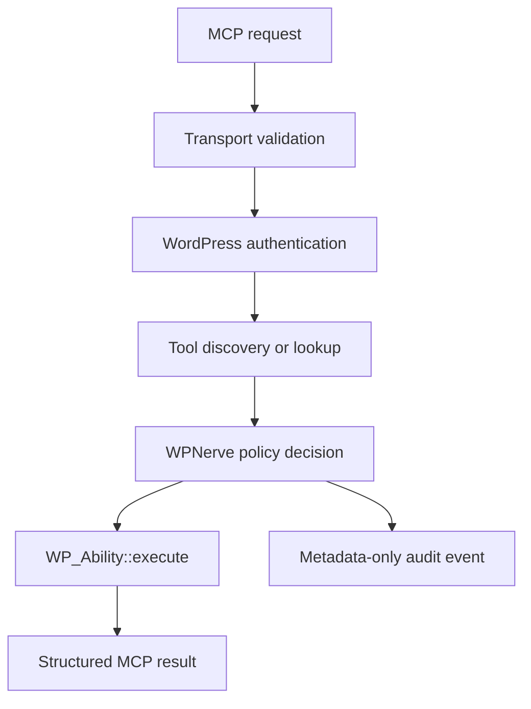

# WPNerve architecture

## Objective

WPNerve provides a self-contained, secure bridge between MCP clients and native
WordPress capabilities. WordPress remains the system of record and authorization
authority. No WPNerve-owned service sits in the request path.

## Design boundaries

### Transport

`HttpTransport` owns the WordPress REST route, HTTP status, TLS and Origin policy,
request-size limits, cache headers, and extraction of request headers. It does not
know how an ability works.

### Protocol

`RequestValidator` validates JSON-RPC envelopes and MCP `2026-07-28` mirrored
headers. `JsonRpcHandler` dispatches modern stateless requests and the bounded
legacy compatibility surface. `AbilityToolRegistry` maps native abilities to
deterministically ordered MCP tools.

### Policy

`PolicyEngine` is the mandatory gateway for discovery and execution. It reads
WPNerve-specific ability metadata and applies secure defaults. An unknown risk
classification is treated as privileged.

### Abilities

Abilities contain WordPress business logic, JSON Schemas, capability callbacks,
and semantic annotations. They do not parse HTTP or MCP messages.

### Audit

`AuditRepository` stores execution metadata only: user, client identity reported
by the client, protocol, method, tool, risk, result, duration, and error code.
Credentials and tool arguments are intentionally excluded.

## Protocol eras

WPNerve is modern-first:

- `2026-07-28`: stateless per-request metadata and `server/discover`.
- `2025-11-25`: bounded initialization-based compatibility.
- `2025-06-18`: bounded initialization-based compatibility.

No legacy session is persisted. Session IDs received from old clients are ignored;
the exposed tools are stateless from the protocol's perspective.

## Runtime lifecycle

1. WordPress authenticates the request, including Application Passwords.
2. The REST permission callback enforces TLS and the transport capability.
3. The transport validates JSON and selects the protocol era.
4. Modern mirrored headers are compared with body values.
5. The handler discovers or invokes a tool.
6. The policy engine makes an independent authorization decision.
7. `WP_Ability::execute()` validates input, checks object permissions, executes,
   and validates output.
8. WPNerve records a metadata-only audit event.

## Extensibility

The initial registry exposes only the `wp-nerve/` namespace. A future public SDK
will provide a reviewed opt-in contract for third-party abilities. It will never
expose every registered ability merely because it exists.
